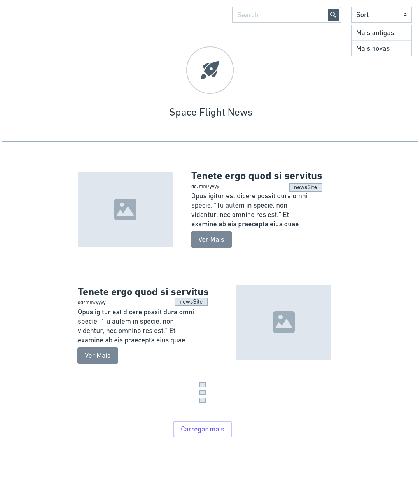

### Front-End:

Nessa etapa você deverá desenvolver uma aplicação web para consumir a API que você criou. Você deve limitar o `request` para exibir apenas 10 resultados.

Para o desenvolvimento você pode utilizar algum framework CSS ou criar seu proprio estilo, recomendamos:
- Tailwind CSS: https://tailwindcss.com/
- Material UI: https://material-ui.com/
- Angular Material: https://material.angular.io/
- Bootstrap: https://getbootstrap.com/
- Bulma: https://bulma.io/

#### Wireframe

 

#### Cores, fontes e inspiração

**Obrigatório 1** - Seguir o wireframe para a página de listagem de artigos;

**Obrigatório 2** - Seguir a paleta de cores e as fontes definidas na imagem acima;

**Obrigatório 3** - Desenvolver a funcionalidade do buscador para que seja possível listar artigos que contenham as palavras no título;

**Obrigatório 4** - Desenvolver a funcionalidade para ordenar os artigos por data, da mais antiga para a mais nova e da mais nova para a mais antiga;

**Obrigatório 5** - Ao clicar no botão "Carregar mais" deve fazer uma nova requisição para carregar mais 10 artigos na página.

**Diferencial 1** Desenvolver as funcionalidades para criar , atualizar e remover artigos.

**Diferencial 2** Escrever Unit Tests ou E2E Test. Escolher a melhor abordagem e biblioteca;

**Diferencial 3** Configurar Docker no Projeto para facilitar o Deploy da equipe de DevOps;
